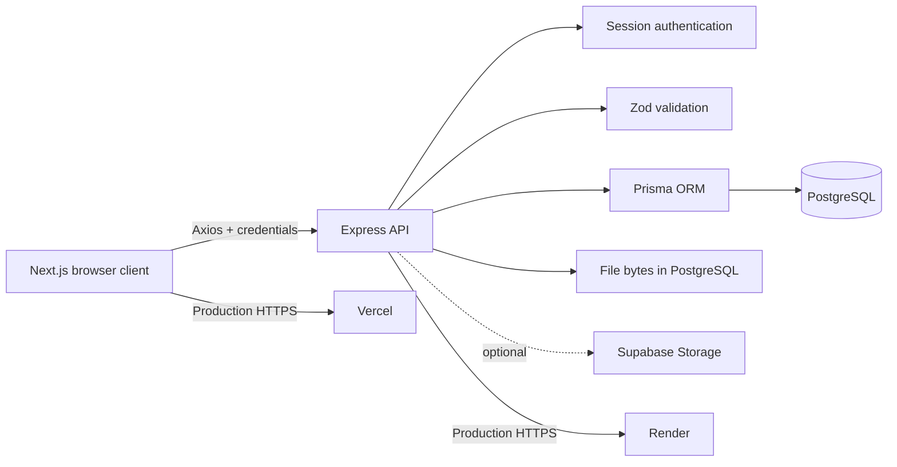

# AetherCloud

> A polished, full-stack cloud file workspace for uploading, organizing, sharing, and recovering files from anywhere.

<p align="center">
	<a href="https://aether-cloud-app.vercel.app">Live application</a> |
	<a href="https://aether-cloud-app.onrender.com/health">API health</a> |
	<a href="https://github.com/SaurabhPandey016">GitHub</a> |
	<a href="https://www.linkedin.com/in/saurabhpandey-/">LinkedIn</a>
</p>

<p align="center">
	
	
	
	
	
	
</p>

## Product Overview

AetherCloud is a production-oriented cloud drive experience designed around the everyday file lifecycle:

```text
Capture -> Organize -> Find -> Share -> Recover
```

It combines a responsive Next.js dashboard with a secure Express API, relational PostgreSQL metadata, session-based authentication, granular sharing permissions, expiring public links, and soft-delete recovery workflows.

The project demonstrates how to take a product from interface and data modeling through API design, authentication, deployment, and cross-origin production behavior.

## Live Demo

| Surface | URL |
| --- | --- |
| Web application | [aether-cloud-app.vercel.app](https://aether-cloud-app.vercel.app) |
| Backend health check | [aether-cloud-app.onrender.com/health](https://aether-cloud-app.onrender.com/health) |

The application is designed for authenticated use. Create an account from the signup screen to explore the complete workspace flow.

## Feature Set

### Workspace

- Drag-and-drop and picker-based multi-file uploads
- Folder hierarchy with breadcrumbs and nested folders
- File listing with search, filtering, sorting, and request pagination parameters
- File download, rename, move, delete, and permanent deletion
- Storage usage summary and configurable quota values
- Starred files and recent files views
- Responsive dashboard with collapsible navigation

### Sharing

- Share files and folders with registered users
- `VIEWER` and `EDITOR` permissions
- Share revocation and ownership checks
- Public links for files and folders
- Optional public-link passwords
- Optional expiration dates
- Dedicated recipient access experience for shared content

### Account and recovery

- Signup, login, logout, and current-session validation
- HTTP-only session cookies
- Profile updates and avatar support in the data model
- Trash view with restore and empty-trash workflows
- Soft deletion with retention configuration

## Architecture



### Request lifecycle

1. The Next.js client sends JSON or multipart requests through a shared Axios client.
2. `withCredentials: true` allows the browser to send the HTTP-only session cookie.
3. Express applies security headers, compression, CORS, body parsing, and session middleware.
4. Protected routes run `authenticate`, which resolves the session user through Prisma.
5. Controllers enforce ownership and sharing rules before reading or mutating data.
6. Prisma persists relational metadata and file data in PostgreSQL.

## Technology Stack

### Frontend

| Technology | Role |
| --- | --- |
| Next.js 16 | App Router, routing, static and dynamic rendering |
| React 19 | Component-based UI and client-side interactions |
| TypeScript | Typed application code and API contracts |
| Tailwind CSS 4 | Responsive visual system and utility styling |
| Axios | Credentialed HTTP client and API interceptors |
| Zustand | Lightweight global authentication and file state |
| React Dropzone | Drag-and-drop upload interaction |
| SWR | Client data-fetching support |
| Lucide React | Consistent interface icons |
| date-fns | Date formatting and date utilities |

### Backend

| Technology | Role |
| --- | --- |
| Node.js | JavaScript runtime |
| Express 5 | HTTP API and middleware pipeline |
| Prisma 5 | Type-safe PostgreSQL ORM and schema management |
| PostgreSQL | Relational persistence for users, files, folders, shares, links, trash, and sessions |
| express-session | Cookie-backed authenticated sessions |
| bcrypt | Password hashing and verification |
| Zod | Request payload validation |
| Multer | Multipart file upload handling |
| Helmet | HTTP security headers |
| CORS | Credentialed cross-origin access control |
| Morgan | Request logging |
| Compression | Response compression |
| Supabase JS | Optional storage integration support |

### Delivery and operations

- Vercel for the Next.js frontend
- Render for the Express API
- Supabase PostgreSQL for the database
- Environment-based configuration with `dotenv`
- Prisma Client generation during setup and deployment
- Production HTTPS with proxy-aware secure session cookies

## Project Structure

```text
Project-6/
├── client/
│   ├── public/                  # Static assets
│   └── src/
│       ├── app/                 # App Router pages and layouts
│       ├── components/          # Dashboard and reusable UI components
│       └── lib/
│           ├── api.ts           # Axios client and API modules
│           ├── hooks/           # Authentication and route hooks
│           └── stores/          # Zustand state stores
├── server/
│   ├── config/                 # Database and service configuration
│   ├── controllers/            # Request handlers and business rules
│   ├── middlewares/            # Authentication and validation
│   ├── prisma/schema.prisma    # Relational data model
│   ├── routes/                 # API route definitions
│   ├── storage/                # Local binary storage workspace
│   ├── tests/                  # Integration and workflow tests
│   └── server.js               # Express application entry point
└── README.md
```

## Local Development

### Prerequisites

- Node.js 20 or newer
- npm
- PostgreSQL or a reachable Supabase PostgreSQL database
- A database connection string with a direct connection URL for Prisma operations

### 1. Configure the API

Create `server/.env`:

```env
PORT=10000
NODE_ENV=development
DATABASE_URL=postgresql://...
DIRECT_URL=postgresql://...
SESSION_SECRET=replace-with-a-long-random-secret
CLIENT_URL=http://localhost:3000
MAX_FILE_SIZE=104857600
TRASH_RETENTION_DAYS=30
STORAGE_QUOTA_BYTES=107374182400
```

Never commit real database credentials or production secrets.

### 2. Install and prepare the API

```bash
cd server
npm install
npx prisma generate
npx prisma db push
npm run dev
```

The API runs at `http://localhost:10000`.

### 3. Configure and run the client

Create `client/.env.local`:

```env
NEXT_PUBLIC_API_URL=http://localhost:10000/api
```

Then start the dashboard:

```bash
cd client
npm install
npm run dev
```

Open [http://localhost:3000](http://localhost:3000).

For local HTTP development, keep `NODE_ENV=development`. Production secure cookies require HTTPS and are enabled automatically when `NODE_ENV=production`.

## API Surface

All API routes are prefixed with `/api`.

| Area | Endpoints |
| --- | --- |
| Auth | `POST /auth/signup`, `POST /auth/login`, `POST /auth/logout`, `GET /auth/me`, `PUT /auth/profile` |
| Folders | `POST /folders`, `GET /folders`, `GET /folders/:folderId`, rename, move, delete, breadcrumbs |
| Files | upload, list, download, rename, move, delete, favorite, recent, storage |
| Sharing | user shares, public links, access, revoke, shared-item listing |
| Trash | list, restore, empty, permanent delete |
| Search | global search, shared with me, shared by me |
| Operations | `GET /health` |

Protected endpoints require the authenticated `aethercloud-session` cookie. Public-link access is intentionally available without an account where the link policy permits it.

## Security and Reliability Decisions

- Passwords are hashed with bcrypt and never returned from API responses.
- Session cookies are HTTP-only and use `SameSite=Lax` locally and `SameSite=None; Secure` in production.
- Express trusts the Render proxy in production so secure cookies work correctly behind TLS termination.
- CORS uses an explicit production allowlist and credential support.
- Request payloads are validated before controllers execute.
- Helmet adds baseline browser security headers.
- File and folder ownership is checked before mutations.
- Sharing permissions distinguish viewing from editing.
- Deleted records use a recoverable trash lifecycle instead of immediate destructive deletion.
- Production secrets are supplied through hosting-provider environment variables.

## Quality Checks

Frontend production build:

```bash
cd client
npm run build
```

Frontend linting:

```bash
cd client
npm run lint
```

Backend syntax check:

```bash
node --check server/server.js
```

Backend integration tests:

```bash
cd server
node --test tests/comprehensive.test.js tests/upload-download.test.js
```

The most important authentication smoke test is:

```text
signup/login -> session cookie -> GET /api/auth/me -> protected folders/files request
```

## Deployment

### Vercel

Set the frontend environment variable:

```env
NEXT_PUBLIC_API_URL=https://aether-cloud-app.onrender.com/api
```

Deploy the `client` application with the standard Next.js build command.

### Render

Set the API environment variables:

```env
NODE_ENV=production
PORT=10000
CLIENT_URL=https://aether-cloud-app.vercel.app
DATABASE_URL=postgresql://...
DIRECT_URL=postgresql://...
SESSION_SECRET=<strong-stable-secret>
```

Do not set a cookie domain for the Vercel frontend. The session cookie belongs to the API host and is sent cross-origin through CORS credentials. Confirm the deployed service at `/health` after each release.

## Engineering Highlights

- Designed a complete file lifecycle instead of a basic upload demo.
- Modeled nested folders, ownership, favorites, user shares, public links, and trash in a relational schema.
- Built a reusable API client with centralized credential handling and error normalization.
- Separated public authentication checks from protected-route redirects to avoid login loops and poor landing-page UX.
- Diagnosed and fixed cross-origin session behavior across localhost, Vercel, and Render.
- Added production-aware proxy and cookie behavior without breaking local HTTP development.
- Kept controllers, middleware, routes, and state stores organized by responsibility.

## Roadmap

- Move sessions from the default in-memory store to a managed PostgreSQL or Redis-backed session store for multi-instance production scaling.
- Add automated CI checks for build, lint, schema validation, and integration tests.
- Add virus scanning and content-type validation for uploaded files.
- Add resumable uploads and object storage for larger files.
- Add observability dashboards, rate limiting, and structured audit events.

## Author

**Saurabh Pandey**

- Email: [developersaurabh001@gmail.com](mailto:developersaurabh001@gmail.com)
- GitHub: [SaurabhPandey016](https://github.com/SaurabhPandey016)
- LinkedIn: [saurabhpandey-](https://www.linkedin.com/in/saurabhpandey-/)

Built as a full-stack engineering project focused on secure file workflows, practical system design, and a polished user experience.
