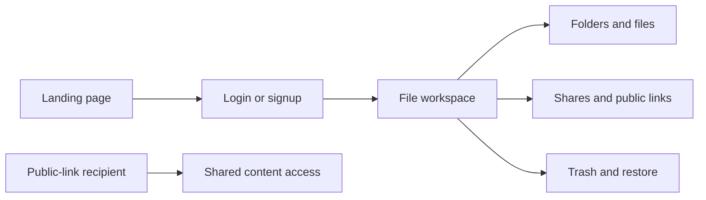

# AetherCloud Client

> The responsive Next.js workspace for secure file management, collaboration, and sharing.

<p align="center">
	
	
	
	
	
</p>

<p align="center">
	<a href="https://aether-cloud-app.vercel.app">Open the live workspace</a> |
	<a href="../README.md">View the full project architecture</a>
</p>

## Experience Map



## What the Client Does

The client turns AetherCloud's file APIs into a focused, responsive workspace:

- Browse nested folders with breadcrumbs and predictable navigation.
- Upload one or many files through a picker or drag-and-drop interaction.
- Search by name and refine results by type, owner, and sort order.
- Download, rename, move, favorite, delete, and recover files.
- Share with registered users as `VIEWER` or `EDITOR`.
- Create expiring and optionally password-protected public links.
- View shared content through a dedicated recipient route.
- Keep public pages usable without forcing unauthenticated visitors into login.

## Frontend Stack

| Tool | Responsibility |
| --- | --- |
| Next.js App Router | Pages, layouts, route transitions, and production rendering |
| React 19 | Interactive UI components and client workflows |
| TypeScript | Component props, API payloads, and state contracts |
| Tailwind CSS 4 | Responsive styling and visual system |
| Zustand | Authentication and file state shared across dashboard views |
| Axios | One credentialed API client for JSON and multipart requests |
| React Dropzone | Upload interaction and drag state |
| SWR | Client data-fetching support |
| Lucide React | Accessible, consistent interface icons |
| date-fns | Date formatting and time-oriented UI helpers |
| shadcn-compatible primitives | Reusable UI composition patterns |

## Client Architecture

```text
src/
├── app/
│   ├── page.tsx                 # Public landing experience
│   ├── login/                   # Login flow
│   ├── signup/                  # Account creation flow
│   ├── dashboard/               # Protected file workspace
│   │   ├── shared/              # Shared-with-me view
│   │   ├── starred/             # Favorites view
│   │   ├── trash/               # Recovery workflows
│   │   └── settings/            # Profile/settings view
│   └── shared/[token]/          # Public-link recipient experience
├── components/
│   ├── dashboard/               # Header, sidebar, explorer, dialogs
│   └── ui/                      # Reusable interface primitives
└── lib/
		├── api.ts                   # Axios client and API modules
		├── hooks/useAuth.ts         # Public and protected auth behavior
		└── stores/                  # Zustand stores
```

### Authentication behavior

The client uses HTTP-only session cookies rather than storing tokens in browser storage:

1. `api.ts` creates one Axios instance with `withCredentials: true`.
2. `authStore` owns login, signup, logout, and current-user state.
3. `useAuth` checks a public page without redirecting unauthenticated visitors.
4. `useProtectedRoute` redirects only after the auth check finishes.
5. A 401 response clears client auth state without creating a redirect loop.

## Run Locally

### Prerequisites

- Node.js 20 or newer
- The AetherCloud API running on port `10000`

Create `.env.local`:

```env
NEXT_PUBLIC_API_URL=http://localhost:10000/api
```

Install and start the client:

```bash
npm install
npm run dev
```

Open [http://localhost:3000](http://localhost:3000).

## Commands

```bash
npm run dev       # Start Next.js development mode
npm run build     # Create the optimized production build
npm run start     # Serve the production build
npm run lint      # Run ESLint
```

## Production Configuration

For the deployed Vercel application:

```env
NEXT_PUBLIC_API_URL=https://aether-cloud-app.onrender.com/api
```

The API must allow the deployed frontend origin and the browser must be able to send credentialed requests. Do not place session secrets in the client environment; only variables prefixed with `NEXT_PUBLIC_` belong here.

## UI Principles

- Keep the primary file action visible and easy to reach.
- Use loading, empty, error, and success states for async workflows.
- Keep protected route redirects deterministic and history-friendly.
- Make file actions available through both direct controls and contextual menus.
- Preserve layout stability while uploads, lists, and dialogs change state.
- Keep shared-link recipients independent from account-only dashboard flows.

## Quality Gate

```bash
npm run build
npm run lint
```

The build validates route compilation, TypeScript, static generation, and production bundling. The client also depends on the server's session and API contract, so the recommended smoke test is:

```text
Open landing page -> signup/login -> refresh dashboard -> load folders/files -> logout
```

## Deployment

The client is deployed on Vercel. Set the project root to `client` or configure the deployment command for this directory. Next.js automatically serves the App Router application after a successful `npm run build`.

See the [Next.js deployment guide](https://nextjs.org/docs/app/building-your-application/deploying) and the [AetherCloud server README](../server/README.md) for the API dependency.
