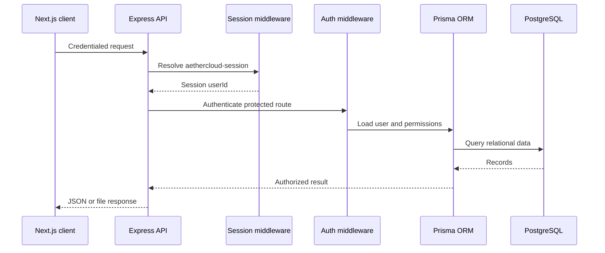

# AetherCloud Server

> A modular Express API that powers authentication, file operations, collaboration, sharing, and recovery.

<p align="center">
	
	
	
	
	
</p>

<p align="center">
	<a href="https://aether-cloud-app.onrender.com/health">Check API health</a> |
	<a href="../README.md">View the full project architecture</a>
</p>

## Backend Mission

The server exposes a focused REST API for a cloud file workspace. It owns the security boundary and the business rules for:

```text
Identity -> Ownership -> Permissions -> File lifecycle -> Recovery
```

The API is intentionally organized by responsibility: routes define the surface, middleware protects and validates it, controllers execute business operations, and Prisma maps those operations to PostgreSQL.

## Service Flow



## Stack

| Technology | Responsibility |
| --- | --- |
| Node.js | Runtime for the API service |
| Express 5 | Routing and middleware pipeline |
| Prisma 5 | Type-safe data access and schema management |
| PostgreSQL | Durable relational persistence |
| express-session | HTTP-only authenticated sessions |
| bcrypt | Password hashing and verification |
| Zod | Request validation schemas |
| Multer | Multipart upload parsing |
| Helmet | Security headers |
| CORS | Credentialed origin policy |
| Morgan | HTTP request logging |
| Compression | Response compression |
| dotenv | Environment configuration |
| Supabase JS | Optional storage integration |

## Source Layout

```text
server/
├── server.js                 # App bootstrap and middleware order
├── config/
│   ├── database.js           # Prisma client lifecycle
│   └── supabase.js           # Optional storage client
├── controllers/              # Auth, files, folders, shares, trash, search
├── middlewares/
│   ├── auth.js               # Authentication and permission checks
│   └── validation.js         # Zod request validation adapter
├── routes/                   # HTTP endpoint definitions
├── prisma/schema.prisma      # PostgreSQL data model
├── storage/                  # Local file storage workspace
├── tests/                    # Integration and workflow tests
└── utils/                    # Errors and validation helpers
```

## Domain Model

The Prisma schema models a complete collaboration system:

- `User`: identity, profile, ownership, and favorites.
- `Folder`: nested hierarchy with parent/child relationships.
- `File`: metadata, binary data, ownership, folder placement, and soft deletion.
- `Share`: user-to-user access with `VIEWER` or `EDITOR` permission.
- `PublicLink`: tokenized external access with expiry and optional password.
- `Trash`: recoverable deletion records with retention timestamps.
- `Session`: relational session shape reserved for durable session storage.

Relations use foreign keys, cascade rules, uniqueness constraints, and targeted indexes for owners, parents, dates, tokens, and recipients.

## API Surface

All application endpoints are prefixed with `/api`.

| Route group | Responsibilities |
| --- | --- |
| `/api/auth` | Signup, login, logout, current user, profile updates |
| `/api/folders` | Create, list, inspect, rename, move, delete, breadcrumbs |
| `/api/files` | Upload, list, download, rename, move, delete, favorite, recent, storage |
| `/api/shares` | User shares, public links, access, revoke, shared-item queries |
| `/api/trash` | List, restore, empty, and permanently delete trash items |
| `/api/search` | Search files and shared content |
| `/health` | Deployment health and timestamp response |

### Representative requests

```text
POST  /api/auth/login
GET   /api/auth/me
POST  /api/files/upload       multipart field: file
GET   /api/files?search=report
PATCH /api/files/:id/favorite
POST  /api/shares/user        Viewer or Editor access
POST  /api/shares/link        Expiry and optional password
GET   /api/files/storage
GET   /api/trash
```

Protected endpoints require the `aethercloud-session` cookie. Public-link access is intentionally separated from account-protected routes.

## Local Development

### Prerequisites

- Node.js 20 or newer
- PostgreSQL or Supabase PostgreSQL
- `DATABASE_URL` and `DIRECT_URL` connection strings

Create `server/.env`:

```env
PORT=10000
NODE_ENV=development
DATABASE_URL=postgresql://...
DIRECT_URL=postgresql://...
SESSION_SECRET=replace-with-a-long-random-secret
CLIENT_URL=http://localhost:3000
MAX_FILE_SIZE=104857600
TRASH_RETENTION_DAYS=30
STORAGE_QUOTA_BYTES=107374182400
```

Install, prepare Prisma, and start the service:

```bash
npm install
npx prisma generate
npx prisma db push
npm run dev
```

The API listens on [http://localhost:10000](http://localhost:10000).

## Commands

```bash
npm run dev       # Start with nodemon
npm start         # Start the production-style Node process
npx prisma generate
npx prisma db push
```

## Configuration and Deployment

For Render production deployment:

```env
NODE_ENV=production
PORT=10000
CLIENT_URL=https://aether-cloud-app.vercel.app
DATABASE_URL=postgresql://...
DIRECT_URL=postgresql://...
SESSION_SECRET=<strong-stable-secret>
```

Production behavior uses:

- `SameSite=None` and `Secure` session cookies for the Vercel-to-Render boundary.
- `trust proxy` so Express recognizes Render's TLS-terminated HTTPS requests.
- An explicit CORS allowlist with `credentials: true`.
- A stable `SESSION_SECRET` across restarts.

Do not commit `.env` files or paste database credentials into source control. Do not set a cookie domain for the Vercel frontend; the cookie belongs to the API host.

## Storage Accounting

`GET /api/files/storage` calculates active usage from non-deleted file records. The quota comes from `STORAGE_QUOTA_BYTES`, with a default of 100 GiB when the value is not supplied. Deleted files are excluded from active usage.

Binary file data is currently supported in PostgreSQL, with optional Supabase storage integration retained for compatible workflows.

## Security Model

- Passwords are hashed with bcrypt before persistence.
- Authentication uses HTTP-only session cookies rather than browser-accessible token storage.
- CORS validates the configured frontend origin in production.
- Request bodies are validated before controller logic runs.
- Authentication loads the user from the current session and Prisma.
- Ownership and share permissions are checked before mutations.
- Public-link passwords are stored as bcrypt hashes.
- Public-link expiry is checked before content access.
- Helmet and compression are applied before the route stack.
- Error handling is centralized through the API error middleware.

## Testing

Run the integration suites from the `server` directory:

```bash
node --test tests/comprehensive.test.js tests/upload-download.test.js
```

Useful additional suites include `mvp.test.js`, `simple-upload.test.js`, `debug.test.js`, and `db-verification.js`.

The core authentication smoke test is:

```text
signup/login -> Set-Cookie -> GET /api/auth/me -> folders/files -> logout
```

## Operational Roadmap

- Replace the default in-memory session store with PostgreSQL or Redis for multi-instance scaling.
- Add rate limiting and structured audit logging.
- Add file virus scanning and stronger content-type verification.
- Move high-volume binary storage to managed object storage.
- Add CI for Prisma validation, backend tests, frontend build, and security checks.
- Add metrics and alerting around uploads, authentication failures, and storage usage.
